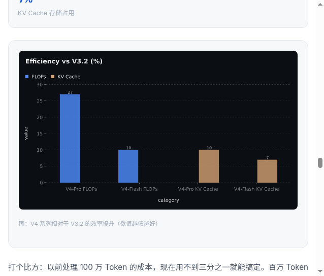

# 只需几步，我用 AI 生成了 DeepSeek V4 炸裂介绍文案

> 全程使用 Trae SOLO MTC 模式，从读论文到出推文，一气呵成。

## 前言

2026 年 4 月 24 日，DeepSeek 发布了 V4 系列预览版。1.6T 参数、100 万 Token 上下文、Codeforces 全球第 23 名——这些数字太炸了，我忍不住想写一篇推文。

但问题是：58 页的技术论文，从哪里开始？数据图表怎么做？头图怎么搞？

答案是：**让 AI 帮我干**。

整个过程中，我使用的是 **Trae SOLO 的 MTC（多轮对话协作）模式**。说实话，这个模式彻底改变了我对 AI 编程助手的认知——它不只是帮你写代码的工具，更像是一个全能搭档。我只需要告诉它"我要什么"和"做成什么样"，它就能帮我读论文、画插图、写代码、调样式、甚至生成搞笑梗图。

**一句话总结：我负责决策和审美，AI 负责执行。**

最终效果长这样：


---

## 第一步：准备资料，让 AI 帮你读论文

### 1.1 下载论文

DeepSeek V4 的技术报告可以在 HuggingFace 上找到，PDF 一共 58 页。如果你不想一页一页翻，完全可以——因为 AI 会帮你读。

### 1.2 让 AI 提取关键信息

我直接把 PDF 丢给了 Trae SOLO，然后说：

> "帮我提取这篇论文的核心信息：模型架构、参数规模、关键技术创新、评测数据。"

几秒钟后，AI 就把 58 页论文浓缩成了一份结构化的数据卡片：

| 维度 | V4-Pro（旗舰版） | V4-Flash（轻量版） |
|------|-----------------|-------------------|
| 总参数 | 1.6T | 284B |
| 激活参数 | 49B | 13B |
| 上下文长度 | 1M Token | 1M Token |
| 训练数据 | 33T Tokens | 32T Tokens |
| 路由专家数 | 384 | 256 |

### 1.3 补充最新信息

论文里没有的信息，比如发布日期、国产算力细节、社区反应等，我让 AI 去搜索补充。就这样，**资料准备阶段基本零人工介入**。

---

## 第二步：AI 生成炸裂头图

公众号推文，头图就是门面。我想要一个科技感十足的头图，但我不懂设计。

于是我告诉 AI：

> "生成一张公众号头图，深蓝科技感背景，中间有大大的 V4 字样，带有数据流和粒子效果。尺寸 1068x455px，比例 2.35:1。"

几秒后，一张炸裂的头图就出来了：


说实话，比我用 Photoshop 搞半天强多了。**关键是我不需要懂设计，只需要会描述我想要什么。**

> 💡 **小贴士**：公众号头图推荐尺寸 1068×455px（2.35:1），封面图推荐 900×383px。

---

## 第三步：用代码生成公众号推文 docx

### 3.1 为什么用代码生成？

你可能会问：为什么不直接在 Word 里写？

因为用代码生成 docx 有几个巨大优势：
- **排版精确控制**：字体、字号、间距、颜色全部代码定义，不会跑偏
- **一键复用**：下次写其他推文，改改数据就能复用
- **版本管理**：代码可以 Git 管理，Word 文件不行

### 3.2 技术方案

我用的方案是 **docx-js**（npm 包），配合 Node.js 运行。核心思路很简单：

```javascript
import { Document, Packer, Paragraph, TextRun, Table, ... } from 'docx';
import fs from 'fs';

const doc = new Document({
  sections: [{
    children: [
      // 标题
      new Paragraph({
        children: [new TextRun({ text: "DeepSeek V4：百万 Token 时代的开源新王者", bold: true, size: 48 })],
        alignment: 'center',
      }),
      // 正文段落...
      // 表格...
      // 图片...
    ]
  }]
});

const buffer = await Packer.toBuffer(doc);
fs.writeFileSync('DeepSeek_V4_公众号推文.docx', buffer);
```

### 3.3 推文内容结构

我设计了 8 个章节，每个章节都有明确的"任务"：

1. **引子**：用悬念开头 + 三个数字冲击（1.6T / 100万 / 全球第23）
2. **两个版本一览**：V4-Pro vs V4-Flash 对比表格
3. **五大技术亮点**：CSA+HCA、mHC、Muon、FP4、国产算力——每个都用通俗比喻解释
4. **效率革命**：用数据卡片展示 FLOPs 和 KV Cache 的对比
5. **性能登顶**：知识/推理/Agent/长上下文 四维度评测
6. **后训练创新**：专家训练 + 统一蒸馏的两阶段范式
7. **开源与生态**：HuggingFace 开源、社区意义
8. **总结与展望**：未来方向 + 结尾金句

### 3.4 运行脚本

```bash
node generate_article.mjs
```

输出：`DeepSeek_V4_公众号推文.docx`（115KB）

就这么简单，**一篇完整的公众号推文就生成了**。

---

## 第四步：加入 AI 生成的技术插图

光有文字太干了。我决定给推文加入技术插图，让读者一眼就能理解复杂的架构概念。

### 4.1 五张插图的生成思路

我给 AI 描述了每张图的需求：

| 插图 | 描述 | 效果 |
|------|------|------|
| CSA+HCA 注意力 | 蓝色光束通过漏斗结构压缩的数据流可视化 | 见下方截图 |
| mHC 超连接 | 神经网络层间信号流动，发光节点连接 | — |
| Muon 优化器 | 两条收敛曲线对比，一条平滑一条震荡 | — |
| FP4 量化 | 数据从大立方体压缩到小立方体的过程 | — |
| 昇腾 950PR 芯片 | 深蓝色调的 AI 芯片渲染，发光电路 | — |

### 4.2 效果展示

以 CSA+HCA 注意力机制示意图为例，AI 生成的效果长这样：


是不是比纯文字好理解多了？**读者不需要懂 Transformer 的数学原理，看一眼图就明白"压缩再处理"的核心思想。**

---

## 第五步：用数据图表让推文更有说服力

技术推文没有数据图表，就像吃火锅没有蘸料——差点意思。

### 5.1 四张数据图表

我用 AI 的图表生成工具做了四张数据可视化：

1. **效率对比柱状图**：V4-Pro / V4-Flash 相对于 V3.2 的 FLOPs 和 KV Cache 对比
2. **知识能力雷达图**：V4-Pro-Max vs GPT-5.4 vs Gemini-3.1-Pro 多维度对比
3. **Agent 能力对比条形图**：SWE-Verified、Terminal Bench、BrowseComp 多模型对比
4. **长上下文能力对比柱状图**：MRCR 1M 和 CorpusQA 1M 多模型对比

### 5.2 效果展示



数据图表的好处是：**读者可以直观看到差距**。比如 V4-Flash 的 FLOPs 只有 V3.2 的 10%——这个数字写在文字里不痛不痒，但放在柱状图里，差距一目了然。

---

## 第六步：加入搞笑梗图，让推文活起来

这是我最喜欢的一步。

### 6.1 为什么加梗图？

技术推文最大的问题是**太严肃**。读者看两段就开始走神。梗图的作用就是"打断"这种严肃感，让读者会心一笑，然后继续看下去。

### 6.2 七张梗图的设计

我给 AI 描述了七个场景：

| 梗图 | 场景 | 笑点 |
|------|------|------|
| 程序员崩溃 | 面对屏幕上滚不到头的代码 | "老板说要处理一百万个 Token" |
| V3.2 震惊 | 目瞪口呆看着 V4 的效率数据 | "你确定我们用的是同一个架构？" |
| MoE 快递分拣 | 包裹被分配到不同专家窗口 | "MoE 路由的本质就是快递分拣中心" |
| FP4 存储对比 | 大仓库 vs 小收纳盒 | "同样的数据，FP16 要仓库，FP4 要收纳盒" |
| Codeforces 领奖台 | AI 站在领奖台上，人类选手震惊 | "全球第 23 名，跟真人比的" |
| 芯片举哑铃 | 可爱芯片角色举铁 | "昇腾 950PR：被制裁了但我能举铁" |
| Agent 写代码 | 机器人坐在电脑前 | "正在修复自己的 Bug" |

### 6.3 排版节奏

梗图不是随便插的，我遵循了一个原则：**每 300-500 字插入一张**。这样读者的阅读节奏是：

```
长段落 → 梗图（笑一下）→ 长段落 → 数据图表（看数据）→ 梗图（再笑一下）→ ...
```

### 6.4 效果展示


看到这些图，你是不是也想笑？**这就是梗图的力量——它让技术内容变得有温度。**

---

## 最终效果总览

来一波截图，感受一下最终效果：


整篇推文从资料准备到最终输出，**全程在 Trae SOLO MTC 模式下完成**。我做的事情只有：
1. 告诉 AI 我要写什么
2. 审核和调整 AI 的输出
3. 做最终的美学决策

剩下的——读论文、提取数据、生成图片、写代码、调样式——全部由 AI 完成。

---

## 写在最后

### Trae SOLO MTC 模式的真正价值

在这篇推文的创作过程中，我深刻体会到了 **Trae SOLO MTC 模式的真正价值**：它不是要替代人类，而是让人类专注于"做什么"和"做成什么样"，把"怎么做"交给 AI。

以前写一篇这样的技术推文，我可能需要：
- 花 2 小时读论文做笔记
- 花 1 小时找/做配图
- 花 3 小时写内容
- 花 1 小时调排版

**总计 7 小时。**

现在？**不到 1 小时。** 而且质量不降反升——因为 AI 生成的插图和数据图表，比我手动做的更好看。

这篇推文的每一张图、每一段代码、每一个排版细节，都是我和 AI 协作的成果。**这不是 AI 替我写了推文，而是 AI 让我能写出更好的推文。**

### 鼓励动手尝试

如果你也想用 AI 来提升内容创作效率，我的建议是：

1. **从描述开始**：不要想着"我要怎么实现"，先想"我要什么效果"
2. **迭代而不是一次到位**：先让 AI 出个初版，然后逐步调整
3. **善用截图和预览**：每一步都看效果，不满意就让 AI 改
4. **保持人类审美**：AI 是工具，最终的质量标准由你定义

试试看吧。你会发现，AI 时代的内容创作，真的可以很轻松。

---

*本文使用 Trae SOLO MTC 模式创作，从构思到成文全程 AI 辅助。*
